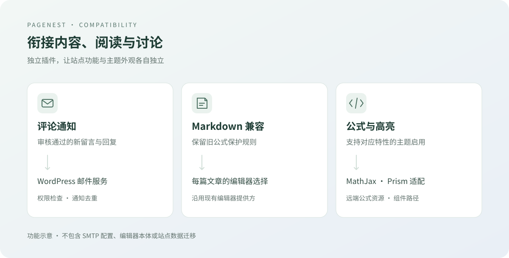

# PageNest Companion

为栖页补上评论邮件通知、旧 Markdown 编辑兼容与公式、高亮适配，让站点功能与主题外观各自独立。

Companion plugin for PageNest: comment notifications, Markdown compatibility, and math rendering.

  

[下载插件](docs/RELEASING.md) · [更新记录](CHANGELOG.md) · [问题反馈](docs/RELEASING.md)

_功能示意图；邮件服务、编辑器及远端公式资源由各自提供方负责。_

## 0.6.0 候选

目录仍为 `pagenest-compatibility`。章节、段落评论和点赞由本插件完整拥有，主题负责展示。通用文章须显式设置 `_pagenest_comments_enabled=1`；未标记文章不会注册段落或暴露评论。旧站标识和记录通过 Web 根之外的显式 JSON 配置接入，不重写旧数据。

## 功能

- **评论通知**：审核通过的新留言通知作者、回复通知原评论者，避免重复发送、本人通知与原生通知重复。
- **编辑兼容**：保留旧 Markdown 公式保护和每篇文章的编辑器选择，支持与现有编辑器组合使用。
- **公式与高亮**：在支持相应特性的主题下接入 MathJax，并按已入队 Prism 资源适配组件目录。
- **旧站衔接**：保留旧通知记录去重，支持旧版升级时的兼容衔接。

## 开始使用

需要 **WordPress 6.0+、PHP 8.0+**，推荐配合 PageNest · 栖页 使用。

1. 从 [GitHub Releases](docs/RELEASING.md) 下载发行附件中的 `pagenest-compatibility-版本号.zip`。
2. 在后台 “插件 → 安装插件 → 上传插件” 上传 ZIP，安装并启用。
3. 按现有邮件服务、编辑器和主题检查评论通知、公式与代码高亮。

选择发行安装包，避免使用 Source code ZIP。从旧版升级时先停用旧插件，避免同时启用两份；现有通知记录继续用于去重，无需复制数据库。

> [完整安装、使用与旧版升级指南](docs/USAGE.md)

## 使用前须知

评论通知使用站点已有邮件服务发送，插件不提供 SMTP 配置、历史通知补发或定时重试。私密文章校验收件账号的阅读权限；通知不复制评论正文，密码保护文章不发送本插件通知。

配合 PageNest 或支持相应功能的主题使用时，文章和页面的公式通过 cdnjs 加载 **MathJax 2.7.7**；已有兼容渲染器时避免重复加载。这会产生第三方网络请求，库文件不随插件打包。具体加载条件见使用指南，旧站适配不保证任意 Markdown/公式插件组合兼容，请按实际插件组合验证。

插件不包含积分规则、社交登录、私人笔记或数据迁移。

> [邮件权限、远端资源与编辑器说明](docs/USAGE.md)

## 更多文档

> [使用指南](docs/USAGE.md) — 安装、通知、编辑器与升级。
>
> [扩展接口](docs/EXTENDING.md) — Prism 路径钩子、主题特性与旧站接入。
>
> [贡献指南](CONTRIBUTING.md) — 开发环境、格式与检查范围。
>
> [发行指南](docs/RELEASING.md) — CI、打包与 GitHub Release。

## 许可证

采用 **GPL-2.0-or-later**，详见 [LICENSE](LICENSE)。版权归 PageNest Contributors（2026）所有；外部插件与远端加载的库保留各自许可证，不随本插件打包。
